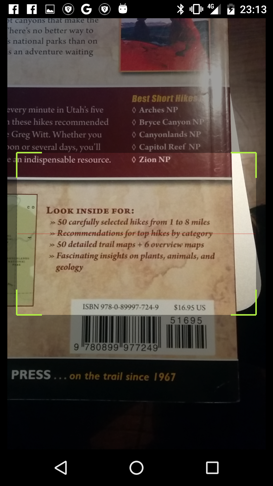
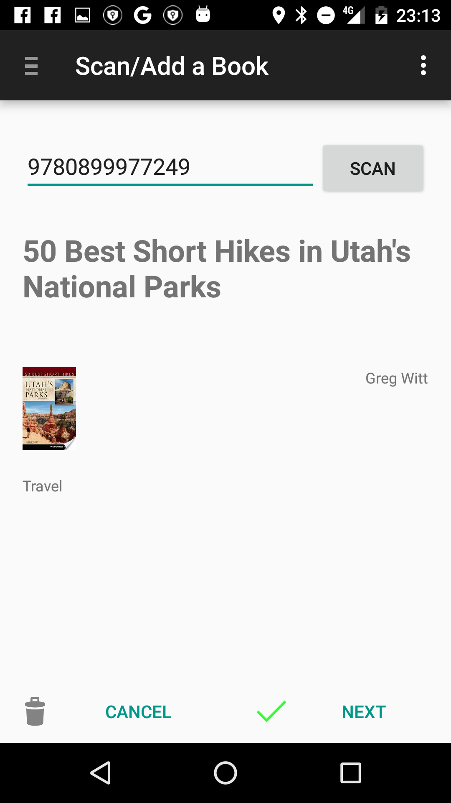

# SuperDuo

By: Olivier Leplus as part of the Udacity Android Nanodegree

This project contains two apps: Alexandria and Football Scores.

Alexandria: A book list and barcode scanner app.

Football Scores: An app that tracks current and future football (soccer) matches.

Apps implements scanner and widgets and Google Books API

### Phone Screenshots
 |  | 
------------ | ------------- | -------------
